# Getting Started: AI-Assisted Programming Documentation Framework

## Complete Workflow Overview

```mermaid
graph TD
    Start([New Project]) --> Req[📋 REQUIREMENTS.md<br/>Business Requirements]
    Req --> Arch[🏗️ ARCHITECTURE.md<br/>Technical Architecture]
    Arch --> Standards[📏 STANDARDS.md<br/>Quality Standards]
    Standards --> EpicFolder[📁 Create EPICS/ folder]

    EpicFolder --> EpicOverview[📊 EPICS/EPICS_OVERVIEW.md<br/>Epic Planning]
    EpicOverview --> EpicFiles[📄 EPICS/EPIC-001.md to EPIC-XXX.md<br/>Individual Epics]

    EpicFiles --> StoryFolder[📁 Create STORIES/ folder]
    StoryFolder --> StoryOverview[📝 STORIES/STORIES_OVERVIEW.md<br/>Story Planning]
    StoryOverview --> StoryFiles[📄 STORIES/STORY-001.md to STORY-XXX.md<br/>Individual Stories]

    StoryFiles --> TaskFolder[📁 Create TASKS/ folder]
    TaskFolder --> TaskOverview[⚙️ TASKS/TASKS_OVERVIEW.md<br/>Task Planning]
    TaskOverview --> SprintPlanning{Sprint Planning}

    SprintPlanning --> TaskFiles[📄 TASKS/TASK-001.md to TASK-XXX.md<br/>Sprint Tasks]
    TaskFiles --> Implement[🤖 AI Implementation]
    Implement --> Test[👤 Human Testing]
    Test --> Complete[✅ Mark Complete]
    Complete --> UpdateTasks[📝 Update TASKS_OVERVIEW.md]

    UpdateTasks --> Learn[📚 LEARNINGS.md<br/>Capture Insights]
    Learn --> NextSprint{Next Sprint?}
    NextSprint -->|Yes| SprintPlanning
    NextSprint -->|No| Deploy[🚀 Project Complete]

    classDef foundation fill:#e3f2fd,stroke:#1976d2
    classDef folders fill:#f3e5f5,stroke:#7b1fa2
    classDef overview fill:#e8f5e8,stroke:#388e3c
    classDef files fill:#fff3e0,stroke:#f57c00
    classDef execution fill:#fce4ec,stroke:#c2185b

    class Req,Arch,Standards foundation
    class EpicFolder,StoryFolder,TaskFolder folders
    class EpicOverview,StoryOverview,TaskOverview overview
    class EpicFiles,StoryFiles,TaskFiles,Implement,Test,Complete files
    class SprintPlanning,Learn,NextSprint execution
```



---

## Phase 1: Project Foundation (1-2 Days)

### 1. Generate REQUIREMENTS.md

**Input**: User requirements + `@1.1_Requirements.md` template

**AI Prompt**:

```
Using @1.1_Requirements.md as a template, help me create comprehensive requirements for my project.

Project Context:
- [Brief description of your project]
- [Target users and their needs]
- [Main problems this project will solve]
- [Key features you envision]

Please systematically fill out each section of the template:
1. Project Overview (problem statement, solution overview, success criteria)
2. Functional Requirements (detailed feature specifications with exact behaviors)
3. Non-Functional Requirements (performance, security, accessibility)
4. Target Users and clear scope boundaries

Ask me clarifying questions for each section to ensure we capture all requirements completely. Reference the template structure but customize content for my specific project needs.
```

**Output**: `REQUIREMENTS.md` in project root

**Success Criteria**:

- [ ] All template sections completed with project-specific content
- [ ] Clear problem statement and solution overview
- [ ] Specific, measurable acceptance criteria for each requirement
- [ ] Non-functional requirements with quantifiable targets

### 2. Generate ARCHITECTURE.md

**Input**: `REQUIREMENTS.md` + `@2.1_SystemArchitecture.md` template + user tech preferences

**AI Prompt**:

```
Based on @REQUIREMENTS.md, help me design system architecture using @2.1_SystemArchitecture.md as a template.

Project Requirements Summary:
- [Extract key functional requirements from REQUIREMENTS.md]
- [Extract performance requirements]
- [Extract integration and external service needs]
- [Extract security and compliance requirements]

My Technology Preferences (if any):
- Frontend: [e.g., React, Vue, or "recommend best option"]
- Backend: [e.g., Node.js, Python, or "recommend best option"]
- Database: [e.g., PostgreSQL, MongoDB, or "recommend best option"]
- Hosting: [e.g., AWS, Vercel, or "recommend best option"]

Please help me:
1. Select appropriate technology stack based on requirements and preferences
2. Design high-level architecture with proper layer separation
3. Create data model for entities identified in REQUIREMENTS.md
4. Define API structure and authentication strategy
5. Plan for scalability, security, and performance requirements
6. Identify integration points and external services needed

Reference specific requirement IDs from REQUIREMENTS.md in your architecture decisions.
```

**Output**: `ARCHITECTURE.md` in project root

**Success Criteria**:

- [ ] Technology stack decisions justified by requirements
- [ ] Clear architecture layers and separation of concerns
- [ ] Data model supports all functional requirements
- [ ] Security and performance considerations addressed
- [ ] Integration strategy defined

### 3. Generate STANDARDS.md

**Input**: `ARCHITECTURE.md` + `@3.1_CodingStandards.md` template

**AI Prompt**:

```
Customize @3.1_CodingStandards.md for my specific technology stack from @ARCHITECTURE.md.

Technology Stack Selected:
- Frontend: [From ARCHITECTURE.md]
- Backend: [From ARCHITECTURE.md]
- Database: [From ARCHITECTURE.md]
- Additional tools: [From ARCHITECTURE.md]

Please customize the template:
1. Update language-specific rules and linting configurations for our stack
2. Customize file organization structure for chosen frameworks
3. Add framework-specific best practices and conventions
4. Ensure all guiding principles are optimized for AI agent comprehension
5. Configure appropriate development tools, testing frameworks, and CI/CD workflows
6. Include specific code quality gates for our technology choices

The standards should maximize AI agent success rates while maintaining high code quality and consistency across the project.
```

**Output**: `STANDARDS.md` in project root

**Success Criteria**:

- [ ] Technology-specific coding standards defined
- [ ] File organization structure matches chosen frameworks
- [ ] AI-friendly coding principles emphasized
- [ ] Quality gates and testing strategies defined
- [ ] Development workflow clearly documented

---

## Phase 2: Work Breakdown Structure (1-2 Days)

### 4. Create EPICS Structure

#### Step 4.1: Create EPICS Folder and Overview

**Input**: `REQUIREMENTS.md` + `@4.2.1_EpicsOverview.md` template

**Actions**:

1. Create `EPICS/` folder in project root
2. Generate `EPICS/EPICS_OVERVIEW.md`

**AI Prompt**:

```
Create EPICS/EPICS_OVERVIEW.md by analyzing @REQUIREMENTS.md and organizing into epics using @4.2.1_EpicsOverview.md as a template.

Reference Documents:
- Requirements: @REQUIREMENTS.md
- Architecture: @ARCHITECTURE.md
- Standards: @STANDARDS.md

Process:
1. Group related functional requirements from REQUIREMENTS.md into epic themes
2. Align epics with architecture layers from ARCHITECTURE.md
3. Consider implementation complexity based on STANDARDS.md
4. Create dependency mapping between epics
5. Assign priorities using P0-P3 framework:
   - P0: Foundation/Security (must have first)
   - P1: Core Features (essential user value)
   - P2: Enhanced Features (important but not critical)
   - P3: Advanced Features (nice to have)

Epic Sizing Guidelines:
- Each epic should represent 2-3 weeks of work
- Include 3-6 stories maximum per epic
- Have clear business value and user impact
- Map to specific architecture components

Output the complete EPICS_OVERVIEW.md with:
- Requirements traceability table
- Epic dependency visualization
- Release planning phases
- Success criteria for each epic
```

**Output**: `EPICS/EPICS_OVERVIEW.md`

#### Step 4.2: Generate Individual Epic Files

**Input**: `EPICS/EPICS_OVERVIEW.md` + `@EPIC-001.md` template

**AI Prompt**:

```
Generate individual epic files in the EPICS/ folder from @EPICS/EPICS_OVERVIEW.md using @EPIC-001.md as a template.

Reference Documents:
- Epic Overview: @EPICS/EPICS_OVERVIEW.md
- Requirements: @REQUIREMENTS.md
- Architecture: @ARCHITECTURE.md

For each epic listed in EPICS_OVERVIEW.md:
1. Create separate EPIC-XXX.md file in EPICS/ folder
2. Follow the exact template structure from @EPIC-001.md
3. Include specific business value and problem statement
4. Define technical scope and architecture impact
5. List prerequisite epics and blocking dependencies
6. Estimate story count and complexity points
7. Define measurable success metrics and acceptance criteria
8. Reference specific requirements from REQUIREMENTS.md

Ensure each epic file is self-contained and provides complete context for story creation.
```

**Output**: `EPICS/EPIC-001.md`, `EPICS/EPIC-002.md`, etc.

**Success Criteria**:

- [ ] All epics from overview have detailed files
- [ ] Each epic maps to specific requirements
- [ ] Dependencies clearly documented
- [ ] Success metrics are measurable

### 5. Create STORIES Structure

#### Step 5.1: Create STORIES Folder and Overview

**Input**: `EPICS/EPICS_OVERVIEW.md` + `@4.3.1_StoriesOverview.md` template

**Actions**:

1. Create `STORIES/` folder in project root
2. Generate `STORIES/STORIES_OVERVIEW.md`

**AI Prompt**:

```
Create STORIES/STORIES_OVERVIEW.md by breaking down epics into user stories using @4.3.1_StoriesOverview.md as a template.

Reference Documents:
- Epic Overview: @EPICS/EPICS_OVERVIEW.md
- Individual Epics: @EPICS/EPIC-001.md, @EPICS/EPIC-002.md, etc.
- Architecture: @ARCHITECTURE.md

Process:
1. For each epic, create 3-6 user stories that deliver independent value
2. Align stories with architecture layers (Frontend, API, Business Logic, Data)
3. Apply story point estimation using fibonacci scale (1, 2, 3, 5, 8)
4. Create dependency mapping between stories
5. Ensure stories fit within sprint boundaries (2-5 days each)

Story Sizing Guidelines:
- 1 point: Simple component or basic CRUD (1-2 days)
- 2 points: Standard form with validation (2-3 days)
- 3 points: Complex feature with integrations (3-4 days)
- 5 points: Advanced multi-component feature (4-5 days)
- 8 points: **BREAK DOWN** - Too large for single story

Each story must:
- Deliver independent user value
- Be testable and demonstrable
- Have clear acceptance criteria
- Reference parent epic and requirements

Output complete STORIES_OVERVIEW.md with estimation summary and dependency mapping.
```

**Output**: `STORIES/STORIES_OVERVIEW.md`

#### Step 5.2: Generate Individual Story Files

**Input**: `STORIES/STORIES_OVERVIEW.md` + `@STORY-001.md` template

**AI Prompt**:

```
Generate individual story files in the STORIES/ folder from @STORIES/STORIES_OVERVIEW.md using @STORY-001.md as a template.

Reference Documents:
- Story Overview: @STORIES/STORIES_OVERVIEW.md
- Epic Overview: @EPICS/EPICS_OVERVIEW.md
- Individual Epics: @EPICS/EPIC-XXX.md files
- Requirements: @REQUIREMENTS.md

For each story listed in STORIES_OVERVIEW.md:
1. Create separate STORY-XXX.md file in STORIES/ folder
2. Follow the exact template structure from @STORY-001.md
3. Write clear user story format: "As a [user type], I want [goal] so that [benefit]"
4. Define specific acceptance criteria using Given-When-Then format
5. Identify technical requirements (Frontend/Backend/Database components)
6. Reference parent epic and related requirements with IDs
7. Include comprehensive definition of done checklist
8. Define task breakdown scope for implementation

Ensure each story is independently deliverable, testable, and provides complete context for task creation.
```

**Output**: `STORIES/STORY-001.md`, `STORIES/STORY-002.md`, etc.

**Success Criteria**:

- [ ] All stories from overview have detailed files
- [ ] Each story has clear user value statement
- [ ] Acceptance criteria are specific and testable
- [ ] Technical scope is well-defined

### 6. Create TASKS Structure

#### Step 6.1: Create TASKS Folder and Overview

**Input**: `STORIES/STORIES_OVERVIEW.md` + `@4.4.1_TasksOverview.md` template

**Actions**:

1. Create `TASKS/` folder in project root
2. Generate `TASKS/TASKS_OVERVIEW.md`

**AI Prompt**:

```
Create TASKS/TASKS_OVERVIEW.md by breaking down stories into AI-implementable tasks using @4.4.1_TasksOverview.md as a template.

Reference Documents:
- Story Overview: @STORIES/STORIES_OVERVIEW.md
- Individual Stories: @STORIES/STORY-XXX.md files
- Architecture: @ARCHITECTURE.md
- Standards: @STANDARDS.md

Process:
1. Break each story into 2-6 granular tasks
2. Size each task at 2-4 hours maximum for high AI success rate
3. Align tasks with coding standards and architecture patterns
4. Create clear dependency chains between tasks
5. Ensure single responsibility per task
6. Define skill areas (Frontend, Backend, Database, Integration, Testing)

Task Breakdown Rules:
- One task = One component OR One API endpoint OR One database change
- Include specific file paths to create/modify
- Define clear input/output requirements and interfaces
- Specify integration points and dependencies
- Add testing and validation requirements
- Reference applicable coding standards

Task Sizing Criteria:
- 1-2 hours: Simple component or function (95% AI success rate)
- 2-3 hours: Standard feature with validation (85% AI success rate)
- 3-4 hours: Complex integration or business logic (70% AI success rate)
- 4+ hours: **MUST BREAK DOWN** - Too complex for reliable AI implementation

Output complete TASKS_OVERVIEW.md with hour estimates, dependencies, and sprint assignment recommendations.
```

**Output**: `TASKS/TASKS_OVERVIEW.md`

**Success Criteria**:

- [ ] All stories broken into 2-6 tasks each
- [ ] All tasks sized 2-4 hours maximum
- [ ] Single responsibility clearly defined per task
- [ ] Dependencies mapped and manageable
- [ ] Specific file paths and components identified

---

## Phase 3: Sprint Execution (Ongoing)

### 7. Sprint Planning and Task Generation

#### Step 7.1: Sprint Planning Session

**Input**: `TASKS/TASKS_OVERVIEW.md` + Sprint capacity + Dependencies

**AI Prompt**:

```
Plan upcoming sprint and select tasks for implementation from @TASKS/TASKS_OVERVIEW.md.

Sprint Context:
- Sprint capacity: [X hours]
- Team capacity: [Frontend/Backend/Full-stack developers available]
- Sprint duration: [1-2 weeks]
- Previous sprint learnings: [Any issues or successes to consider]

Reference Documents:
- Task Overview: @TASKS/TASKS_OVERVIEW.md
- Stories: @STORIES/STORIES_OVERVIEW.md
- Architecture: @ARCHITECTURE.md
- Standards: @STANDARDS.md

Sprint Planning Process:
1. Review task dependencies and identify ready tasks (no blocking dependencies)
2. Select 1-2 complete stories worth of tasks that fit within sprint capacity
3. Prioritize based on business value and technical dependencies
4. Ensure balanced workload across skill areas
5. Plan for 80% capacity to allow for unexpected complexity

Create sprint task list with:
- Selected TASK-XXX IDs and descriptions
- Estimated hours and skill requirements
- Dependency order for implementation
- Risk assessment and mitigation plans
```

#### Step 7.2: Generate Sprint Task Files

**Input**: Selected tasks from sprint planning + `@TASK-001.md` template

**AI Prompt**:

```
Generate detailed TASK-XXX.md files in the TASKS/ folder for the selected sprint tasks using @TASK-001.md as a template.

Sprint Task List: [List of TASK-XXX IDs selected for sprint]

Reference Documents:
- Task Overview: @TASKS/TASKS_OVERVIEW.md
- Story Details: @STORIES/STORY-XXX.md files
- Architecture: @ARCHITECTURE.md
- Standards: @STANDARDS.md
- Learnings: @LEARNINGS.md (if exists from previous sprints)

For each selected task:
1. Create detailed TASK-XXX.md file in TASKS/ folder
2. Follow the exact template structure from @TASK-001.md
3. Include specific implementation requirements and file paths
4. Reference architectural patterns and coding standards
5. Apply relevant success patterns from previous learnings
6. Define clear acceptance criteria for AI self-validation
7. Specify exact files to create/modify with expected structure
8. Include comprehensive testing and integration requirements
9. Add specific examples and code snippets where helpful

Ensure each task is completely self-contained and provides all context needed for successful AI implementation.
```

**Output**: `TASKS/TASK-001.md`, `TASKS/TASK-002.md`, etc. (for sprint tasks only)

### 8. Task Implementation Cycle

#### Step 8.1: AI Task Implementation

**Input**: Individual `TASK-XXX.md` file + All reference documents

**AI Prompt for Implementation**:

```
Implement this task following all project standards and architecture:

Task Specification: @TASKS/TASK-XXX.md

Reference Documents:
- Architecture: @ARCHITECTURE.md
- Coding Standards: @STANDARDS.md
- Related Story: @STORIES/STORY-XXX.md
- Success Patterns: @LEARNINGS.md (if available)

Implementation Requirements:
1. Follow architectural patterns and layer separation from ARCHITECTURE.md
2. Implement according to all coding standards in STANDARDS.md
3. Apply relevant success patterns from LEARNINGS.md
4. Include comprehensive error handling and input validation
5. Write unit tests with 80%+ coverage
6. Add appropriate JSDoc/documentation
7. Ensure clean integration with existing codebase
8. Follow file organization and naming conventions

Deliver production-ready code that meets all acceptance criteria defined in the task specification. Include all files specified in the task with complete implementations.
```

#### Step 8.2: Human Review and Testing

**Review Checklist**:

- [ ] All functional requirements from task met
- [ ] Acceptance criteria verified through testing
- [ ] Error handling works correctly for edge cases
- [ ] Unit tests written and passing
- [ ] Integration with existing code verified
- [ ] Code follows all standards from STANDARDS.md
- [ ] Performance is acceptable for requirements
- [ ] Documentation is complete and accurate

#### Step 8.3: Task Completion and Progress Update

**AI Prompt for Progress Update**:

```
Update @TASKS/TASKS_OVERVIEW.md to reflect completed task status.

Completed Task: @TASKS/TASK-XXX.md
Implementation Outcome: [Success/Issues/Modifications needed]
Time Spent: [Actual hours vs estimated]
Issues Encountered: [List any problems or blockers]
Solutions Applied: [How issues were resolved]

Update the TASKS_OVERVIEW.md:
1. Mark TASK-XXX as "Complete" in status tracking
2. Note any deviations from original estimates
3. Update dependency status for downstream tasks
4. Document any scope changes or additional work discovered
5. Update sprint progress and remaining capacity

Maintain accurate tracking of sprint progress and task completion rates.
```

### 9. Learning Capture and Improvement

#### Generate/Update LEARNINGS.md

**Input**: Completed tasks + Issues encountered + `@4.5.1_CumulativeLearnings.md` template

**AI Prompt for Learning Capture**:

```
Create or update LEARNINGS.md based on sprint experiences using @4.5.1_CumulativeLearnings.md as a template.

Sprint Summary:
- Completed tasks: [List of TASK-XXX completed]
- Implementation outcomes: [Success rates, issues, time accuracy]
- Technical challenges: [Problems encountered and solutions]
- Process insights: [What worked well, what didn't]
- AI agent performance: [Success patterns and failure modes]

Reference Documents:
- Completed Tasks: @TASKS/TASK-XXX.md files
- Architecture: @ARCHITECTURE.md
- Standards: @STANDARDS.md

Update or create LEARNINGS.md with:
1. **Success Patterns**: Document approaches that worked well for AI implementation
2. **Anti-Patterns**: Document approaches that failed or caused issues
3. **Technology-Specific Insights**: Framework/library specific learnings
4. **Process Improvements**: Refinements to task breakdown or documentation
5. **AI Optimization**: Prompt patterns and context that improved success rates
6. **Quality Insights**: Code quality patterns and testing strategies that worked

Focus on actionable insights that will improve future AI task success rates and project quality.
```

**Output**: `LEARNINGS.md` in project root (updated continuously)

---

## File Structure Summary

After following this complete workflow, your project structure will be:

```
ProjectRoot/
├── REQUIREMENTS.md              # Project requirements
├── ARCHITECTURE.md              # System architecture
├── STANDARDS.md                 # Coding standards
├── LEARNINGS.md                 # Cumulative insights
├── EPICS/
│   ├── EPICS_OVERVIEW.md        # Epic planning summary
│   ├── EPIC-001.md              # Individual epic details
│   ├── EPIC-002.md
│   └── ...
├── STORIES/
│   ├── STORIES_OVERVIEW.md      # Story planning summary
│   ├── STORY-001.md             # Individual story details
│   ├── STORY-002.md
│   └── ...
└── TASKS/
    ├── TASKS_OVERVIEW.md        # Task planning and tracking
    ├── TASK-001.md              # Sprint task details
    ├── TASK-002.md
    └── ...
```

## Quality Gates and Success Criteria

### Foundation Phase Gates

- [ ] REQUIREMENTS.md covers all user needs with measurable criteria
- [ ] ARCHITECTURE.md supports all requirements with justified technology choices
- [ ] STANDARDS.md is customized for chosen technology stack

### Planning Phase Gates

- [ ] All requirements mapped to epics in EPICS_OVERVIEW.md
- [ ] All epics broken into 3-6 stories with clear user value
- [ ] All stories broken into 2-6 tasks sized 2-4 hours each
- [ ] Dependencies are manageable and well-documented

### Execution Phase Gates

- [ ] 85%+ AI task success rate maintained
- [ ] All tasks meet acceptance criteria before marking complete
- [ ] Sprint progress tracked accurately in TASKS_OVERVIEW.md
- [ ] Learnings captured and applied to improve future sprints

## Common Troubleshooting

### Low AI Success Rate

- **Check**: Task complexity (should be 2-4 hours max)
- **Check**: Task context (include all necessary reference documents)
- **Apply**: Success patterns from LEARNINGS.md
- **Action**: Break down complex tasks into smaller units

### Dependency Blocking

- **Check**: TASKS_OVERVIEW.md dependency mapping
- **Action**: Implement prerequisite tasks first
- **Alternative**: Reorder sprint tasks to resolve dependencies

### Requirements Gaps

- **Check**: Traceability from REQUIREMENTS.md through epics/stories/tasks
- **Action**: Update requirements and propagate changes through all levels
- **Document**: Changes in LEARNINGS.md for future reference

## Best Practices for Maximum Success

1. **Always Reference Templates**: Use `@filename.md` to provide complete context
2. **Single Responsibility**: One task = one component/endpoint/database change
3. **Clear Context**: Include all relevant reference documents in prompts
4. **Iterative Improvement**: Apply learnings from LEARNINGS.md to each new sprint
5. **Quality First**: Maintain standards compliance and testing requirements
6. **Track Progress**: Keep TASKS_OVERVIEW.md updated with accurate status

This workflow ensures systematic breakdown of any project into AI-implementable tasks while maintaining quality, traceability, and continuous improvement.
