# 2.1_SystemArchitecture

This document details the system architecture for the project.

## 1. Technology Stack

### 1.1 Frontend Stack

- **Framework**: [React / Vue / Angular / Other - TBD]
- **Language**: [TypeScript / JavaScript - TBD]
- **UI Library**: [Material-UI / Tailwind CSS / Bootstrap / Custom - TBD]
- **State Management**: [Redux / Zustand / Context API - TBD]
- **Build Tools**: [Vite / Webpack / Other - TBD]

### 1.2 Backend Stack

- **Runtime/Language**: [Node.js / Python / Java / .NET - TBD]
- **Framework**: [Express / FastAPI / Spring Boot - TBD]
- **Database**: [PostgreSQL / MySQL / MongoDB - TBD]
- **Authentication**: [JWT / OAuth / Session-based - TBD]

### 1.3 Infrastructure

- **Hosting Platform**: [AWS / Vercel / DigitalOcean - TBD]
- **Database Hosting**: [Cloud provider managed / Self-hosted - TBD]
- **File Storage**: [Cloud storage / Local storage - TBD]
- **CI/CD**: [GitHub Actions / GitLab CI - TBD]

---

## 2. High-Level Architecture

### 2.1 System Overview

```mermaid
graph TD
    User[👤 Users] --> Frontend[🌐 Frontend Application]
    Admin[👨‍💼 Admin Users] --> AdminPanel[📊 Admin Panel]

    Frontend --> API[🔧 Backend API]
    AdminPanel --> API

    API --> Auth[🔐 Authentication]
    API --> DB[(🗄️ Database)]
    API --> Storage[📁 File Storage]
    API --> External[🌍 External Services]

    Frontend --> CDN[☁️ Static Assets]

    classDef user fill:#e1f5fe
    classDef app fill:#f3e5f5
    classDef service fill:#e8f5e8
    classDef storage fill:#fce4ec

    class User,Admin user
    class Frontend,AdminPanel app
    class API,Auth service
    class DB,Storage,CDN,External storage
```



### 2.2 Application Layers


---

## 3. Data Architecture

### 3.1 Core Entities

The system will manage the following main entities:

#### User Management

- **Users**: User accounts and authentication
- **Profiles**: User profile information and preferences
- **Roles**: User permissions and access control

#### [Core Business Entities - To Be Defined]

- **[Entity 1]**: [Brief description of primary business object]
- **[Entity 2]**: [Brief description of secondary business object]
- **[Entity 3]**: [Brief description of supporting business object]

### 3.2 Data Relationships


_Note: Specific entity names and detailed schema will be defined during development_

---

## 4. API Architecture

### 4.1 API Design Principles

- **RESTful Design**: Following REST conventions for resource management
- **JSON Communication**: Request/response format in JSON
- **Stateless**: No server-side session storage
- **Versioning**: API versioning strategy (v1, v2, etc.)

### 4.2 Authentication Strategy

- **Token-Based**: JWT or similar token-based authentication
- **Role-Based Access**: Different permission levels for different user types
- **Session Management**: Token refresh and expiration handling

### 4.3 Standard Response Format

```json
{
  "success": boolean,
  "data": {},
  "message": "string",
  "timestamp": "ISO 8601"
}
```

---

## 5. Security Considerations

### 5.1 Authentication & Authorization

- **User Authentication**: Secure login/logout mechanism
- **Password Security**: Encrypted password storage
- **Access Control**: Role-based permissions
- **Session Security**: Secure token management

### 5.2 Data Protection

- **Data Encryption**: Sensitive data encryption at rest and in transit
- **Input Validation**: Server-side validation for all inputs
- **API Security**: Rate limiting and request validation
- **Environment Security**: Secure configuration management

---

## 6. Performance & Scalability

### 6.1 Performance Targets

- **Response Time**: API responses under [X]ms
- **Concurrent Users**: Support for [X] simultaneous users
- **Database Performance**: Query optimization and indexing
- **Caching Strategy**: Application and database caching

### 6.2 Scalability Approach

- **Horizontal Scaling**: Design for multiple server instances
- **Database Scaling**: Read replicas and optimization strategies
- **Content Delivery**: Static asset optimization
- **Monitoring**: Performance monitoring and alerting

---

## 7. Integration Points

### 7.1 External Services

- **Email Service**: [Provider TBD] for transactional emails
- **File Storage**: [Provider TBD] for file uploads and storage
- **Payment Processing**: [Provider TBD] if payment functionality required
- **Analytics**: [Provider TBD] for user behavior tracking

### 7.2 Third-Party APIs

- **[Service Name]**: [Purpose and integration requirements - TBD]
- **[Service Name]**: [Purpose and integration requirements - TBD]

---

## 8. Development Considerations

### 8.1 Code Organization

- **Modular Architecture**: Clear separation of concerns
- **Component Structure**: Reusable and maintainable components
- **Service Layer**: Business logic abstraction
- **Data Access Layer**: Database interaction abstraction

### 8.2 Testing Strategy

- **Unit Testing**: Individual function and component testing
- **Integration Testing**: API and database integration testing
- **End-to-End Testing**: Complete user journey testing
- **Performance Testing**: Load and stress testing

---

## 9. Deployment Architecture

### 9.1 Environment Strategy

- **Development**: Local development environment
- **Staging**: Pre-production testing environment
- **Production**: Live production environment

### 9.2 Infrastructure Requirements

- **Server Requirements**: [CPU, Memory, Storage - TBD]
- **Database Requirements**: [Performance and storage - TBD]
- **Network Requirements**: [Bandwidth and latency - TBD]
- **Backup Strategy**: [Data backup and recovery - TBD]

---

**Notes**:

- This document represents the high-level architectural vision
- Specific technology choices and detailed implementations will be determined during development
- Regular updates to this document will be made as decisions are finalized
