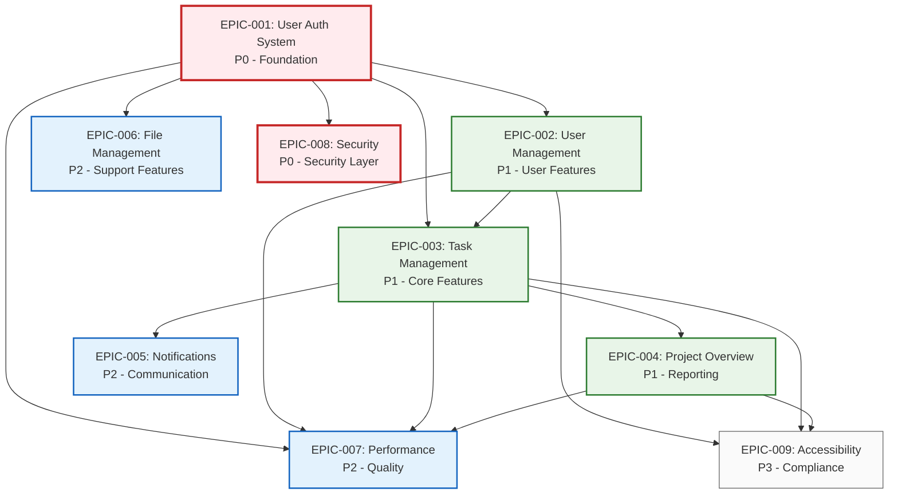

# 4.2.1_EpicsOverview

This document breaks down 1.1_Requirements.md into Epics according to 2.1_SystemArchitecture.md and 3.1_CodingStandards.md.

## Requirements Analysis

| Req ID  | Requirement Name              | Req Type       | Business Priority | Architecture Impact  |
| ------- | ----------------------------- | -------------- | ----------------- | -------------------- |
| REQ-001 | User Authentication           | Functional     | Critical          | Full Stack           |
| REQ-002 | Password Reset                | Functional     | High              | Full Stack           |
| REQ-003 | User Profile Management       | Functional     | High              | Presentation + API   |
| REQ-004 | Task Creation                 | Functional     | High              | Full Stack           |
| REQ-005 | Task Assignment               | Functional     | Medium            | Presentation + Logic |
| REQ-006 | Project Dashboard             | Functional     | Medium            | Presentation + API   |
| REQ-007 | Email Notifications           | Functional     | Medium            | Business Logic       |
| REQ-008 | File Uploads                  | Functional     | Low               | Full Stack           |
| REQ-009 | API Response Time <500ms      | Non-Functional | High              | API + Data           |
| REQ-010 | Support 1000 Concurrent Users | Non-Functional | High              | Infrastructure       |
| REQ-011 | HTTPS Encryption              | Non-Functional | Critical          | Infrastructure       |
| REQ-012 | Input Validation              | Non-Functional | High              | API Layer            |
| REQ-013 | WCAG 2.1 AA Compliance        | Non-Functional | Medium            | Presentation         |

---

## Epic Derivation

### Requirements Grouping Logic

| Epic ID  | Epic Name        | Included Requirements | Rationale                                   |
| -------- | ---------------- | --------------------- | ------------------------------------------- |
| EPIC-001 | User Auth System | REQ-001, REQ-002      | Core authentication and security foundation |
| EPIC-002 | User Management  | REQ-003               | User profile and account management         |
| EPIC-003 | Task Management  | REQ-004, REQ-005      | Core task functionality and workflow        |
| EPIC-004 | Project Overview | REQ-006               | Project visibility and reporting            |
| EPIC-005 | Notifications    | REQ-007               | Communication and user engagement           |
| EPIC-006 | File Management  | REQ-008               | Document and asset handling                 |
| EPIC-007 | Performance      | REQ-009, REQ-010      | System performance and scalability          |
| EPIC-008 | Security         | REQ-011, REQ-012      | Security compliance and data protection     |
| EPIC-009 | Accessibility    | REQ-013               | UI accessibility and compliance             |

---

## Epic Definitions

| Epic ID  | Epic Name        | Priority | Business Value                               | Architecture Layers         | Dependencies |
| -------- | ---------------- | -------- | -------------------------------------------- | --------------------------- | ------------ |
| EPIC-001 | User Auth System | P0       | Enable secure user access and authentication | Full Stack                  | None         |
| EPIC-002 | User Management  | P1       | Allow users to manage profiles and settings  | Presentation + API          | EPIC-001     |
| EPIC-003 | Task Management  | P1       | Core task creation and assignment workflow   | Full Stack                  | EPIC-001     |
| EPIC-004 | Project Overview | P1       | Provide project visibility and dashboards    | Presentation + API          | EPIC-003     |
| EPIC-005 | Notifications    | P2       | Keep users informed of important updates     | Business Logic              | EPIC-003     |
| EPIC-006 | File Management  | P2       | Enable file uploads and document storage     | Full Stack                  | EPIC-001     |
| EPIC-007 | Performance      | P2       | Ensure system meets performance requirements | API + Data + Infrastructure | All Core     |
| EPIC-008 | Security         | P0       | Implement security measures and compliance   | Infrastructure + API        | EPIC-001     |
| EPIC-009 | Accessibility    | P3       | Ensure UI accessibility compliance           | Presentation                | UI Epics     |

---

## Epic Dependencies

---

## Release Planning

### Epic Prioritization

| Release Phase | Epic(s)            | Business Rationale                    |
| ------------- | ------------------ | ------------------------------------- |
| Phase 1       | EPIC-001, EPIC-008 | Security foundation - must have first |
| Phase 2       | EPIC-002, EPIC-003 | Core user and task features           |
| Phase 3       | EPIC-004, EPIC-005 | Enhanced user experience              |
| Phase 4       | EPIC-006, EPIC-007 | Advanced features and optimization    |
| Phase 5       | EPIC-009           | Compliance and accessibility          |

### Success Criteria

| Epic ID  | Epic Success Metrics                                          |
| -------- | ------------------------------------------------------------- |
| EPIC-001 | 100% secure authentication, 0% unauthorized access            |
| EPIC-002 | Users can manage profiles with <2 clicks to key functions     |
| EPIC-003 | Task creation <30 seconds, assignment workflow <5 steps       |
| EPIC-004 | Dashboard loads <3 seconds, displays real-time project status |
| EPIC-005 | 95% notification delivery rate, <1 minute delay               |
| EPIC-006 | Support 10MB+ files, 99.9% upload success rate                |
| EPIC-007 | <500ms API response, 1000+ concurrent users                   |
| EPIC-008 | Pass security audit, 0 critical vulnerabilities               |
| EPIC-009 | WCAG 2.1 AA compliance, screen reader compatible              |
