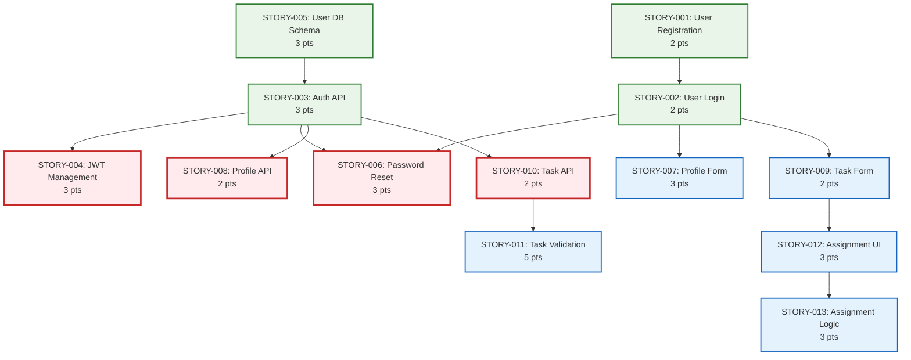

# 4.3.1_StoriesOverview

This document breaks down Epics (4.2.1_EpicsOverview.md) into Stories.

## Epic Breakdown Overview

| Epic ID  | Epic Name        | Total Stories | Story Points | Sprint Estimate | Architecture Distribution                                 |
| -------- | ---------------- | ------------- | ------------ | --------------- | --------------------------------------------------------- |
| EPIC-001 | User Auth System | 6             | 13           | 2 sprints       | Presentation(2), API(1), Logic(1), Data(1), Full Stack(1) |
| EPIC-002 | User Management  | 2             | 8            | 1 sprint        | Presentation(1), API(1)                                   |
| EPIC-003 | Task Management  | 5             | 15           | 2 sprints       | Presentation(2), API(1), Logic(2)                         |
| EPIC-004 | Project Overview | 3             | 10           | 1 sprint        | Presentation(1), API(1), Logic(1)                         |
| EPIC-005 | Notifications    | 2             | 8            | 1 sprint        | Logic(2)                                                  |
| EPIC-006 | File Management  | 3             | 12           | 1-2 sprints     | Presentation(1), API(1), Logic(1)                         |
| EPIC-007 | Performance      | 2             | 8            | 1 sprint        | API(1), Data(1)                                           |
| EPIC-008 | Security         | 2             | 10           | 1 sprint        | Infrastructure(1), API(1)                                 |
| EPIC-009 | Accessibility    | 1             | 6            | 1 sprint        | Presentation(1)                                           |

---

## Story Derivation by Epic

### EPIC-001: User Auth System → Stories

| Story ID  | Story Name           | Points | Layer          | User Value                             | Technical Scope               |
| --------- | -------------------- | ------ | -------------- | -------------------------------------- | ----------------------------- |
| STORY-001 | User Registration    | 2      | Presentation   | Users can create accounts              | Registration form, validation |
| STORY-002 | User Login           | 2      | Presentation   | Users can access their accounts        | Login form, authentication    |
| STORY-003 | Auth API Endpoints   | 3      | API Layer      | System can authenticate users securely | REST endpoints, security      |
| STORY-004 | JWT Token Management | 3      | Business Logic | System manages user sessions           | Token generation, validation  |
| STORY-005 | User Database Schema | 3      | Data Layer     | System stores user data securely       | Database design, encryption   |
| STORY-006 | Password Reset Flow  | 3      | Full Stack     | Users can recover forgotten passwords  | Email integration, workflow   |

### EPIC-002: User Management → Stories

| Story ID  | Story Name        | Points | Layer        | User Value                                 | Technical Scope     |
| --------- | ----------------- | ------ | ------------ | ------------------------------------------ | ------------------- |
| STORY-007 | Profile Edit Form | 3      | Presentation | Users can update their profile information | Form UI, validation |
| STORY-008 | Profile API       | 2      | API Layer    | System can store/retrieve profile data     | CRUD endpoints      |

### EPIC-003: Task Management → Stories

| Story ID  | Story Name         | Points | Layer          | User Value                              | Technical Scope                 |
| --------- | ------------------ | ------ | -------------- | --------------------------------------- | ------------------------------- |
| STORY-009 | Create Task Form   | 2      | Presentation   | Users can create new tasks easily       | Task form UI                    |
| STORY-010 | Task Creation API  | 2      | API Layer      | System can store and manage tasks       | Task endpoints                  |
| STORY-011 | Task Validation    | 5      | Business Logic | System ensures data integrity           | Business rules, validation      |
| STORY-012 | Task Assignment UI | 3      | Presentation   | Users can assign tasks to team members  | Assignment interface            |
| STORY-013 | Assignment Logic   | 3      | Business Logic | System manages task assignment workflow | Assignment rules, notifications |

### EPIC-004: Project Overview → Stories

| Story ID  | Story Name         | Points | Layer          | User Value                                 | Technical Scope            |
| --------- | ------------------ | ------ | -------------- | ------------------------------------------ | -------------------------- |
| STORY-014 | Dashboard Layout   | 3      | Presentation   | Users can view project status at a glance  | Dashboard UI               |
| STORY-015 | Dashboard Data API | 3      | API Layer      | System provides dashboard data efficiently | Data aggregation endpoints |
| STORY-016 | Analytics Service  | 4      | Business Logic | System calculates project metrics          | Analytics logic, reporting |

---

## Story Dependencies

### Dependency Mapping

| Story ID  | Story Name           | Dependencies         | Dependency Reason                             |
| --------- | -------------------- | -------------------- | --------------------------------------------- |
| STORY-001 | User Registration    | None                 | Foundation story                              |
| STORY-002 | User Login           | STORY-001            | Need user accounts before login               |
| STORY-003 | Auth API Endpoints   | STORY-005            | Need database schema before API               |
| STORY-004 | JWT Token Management | STORY-003            | Need auth endpoints before token management   |
| STORY-005 | User Database Schema | None                 | Foundation data structure                     |
| STORY-006 | Password Reset Flow  | STORY-002, STORY-003 | Need login and API before reset functionality |
| STORY-007 | Profile Edit Form    | STORY-002            | Need authentication before profile management |
| STORY-008 | Profile API          | STORY-003            | Need auth endpoints before profile endpoints  |
| STORY-009 | Create Task Form     | STORY-002            | Need authentication before task creation      |
| STORY-010 | Task Creation API    | STORY-003            | Need auth endpoints before task endpoints     |
| STORY-011 | Task Validation      | STORY-010            | Need task API before validation logic         |
| STORY-012 | Task Assignment UI   | STORY-009            | Need task creation before assignment          |
| STORY-013 | Assignment Logic     | STORY-012            | Need assignment UI before backend logic       |

### Critical Path Analysis

---

## Story Acceptance Framework

### Story Sizing Guidelines

| Points | Complexity | Duration  | Criteria                  |
| ------ | ---------- | --------- | ------------------------- |
| 1      | Simple     | 4-6 hours | Basic CRUD, simple UI     |
| 2      | Standard   | 1 day     | Standard form, validation |
| 3      | Complex    | 1-2 days  | Multiple integrations     |
| 5      | Advanced   | 2-3 days  | Complex business logic    |

### Quality Gates

| Gate                 | Criteria                                                                 | Applied To            |
| -------------------- | ------------------------------------------------------------------------ | --------------------- |
| Story Readiness      | Clear acceptance criteria, dependencies identified, UI mockups available | All Stories           |
| Technical Design     | Architecture layer defined, API contracts specified                      | API/Logic Stories     |
| Security Review      | Security requirements documented, threat model reviewed                  | Auth/Security Stories |
| Performance Criteria | Response time targets, load requirements specified                       | Performance Stories   |

---

## Sprint Assignment Strategy

### Sprint 1: Foundation (7 points)

- STORY-001: User Registration (2 pts)
- STORY-005: User Database Schema (3 pts)
- STORY-003: Auth API Endpoints (2 pts)

### Sprint 2: Authentication Core (9 points)

- STORY-002: User Login (2 pts)
- STORY-004: JWT Token Management (3 pts)
- STORY-006: Password Reset Flow (4 pts)

### Sprint 3: User Management (7 points)

- STORY-007: Profile Edit Form (3 pts)
- STORY-008: Profile API (2 pts)
- STORY-009: Create Task Form (2 pts)

### Sprint 4: Task Management (7 points)

- STORY-010: Task Creation API (2 pts)
- STORY-011: Task Validation Logic (5 pts)

### Sprint 5: Task Assignment (6 points)

- STORY-012: Task Assignment UI (3 pts)
- STORY-013: Assignment Logic (3 pts)

---

## Story Estimation Summary

**Total Project Scope**: 26 stories across 9 epics = 90 story points

**Architecture Distribution**:

- Presentation Layer: 10 stories (35%)
- API Layer: 8 stories (31%)
- Business Logic: 6 stories (23%)
- Data Layer: 1 story (4%)
- Full Stack: 1 story (4%)
- Infrastructure: 1 story (4%)

**Complexity Distribution**:

- 1-2 Point Stories: 15 stories (58%) - Quick wins
- 3 Point Stories: 10 stories (38%) - Standard complexity
- 5 Point Stories: 1 story (4%) - High complexity
