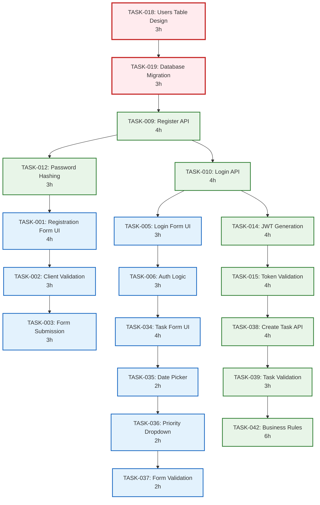

# 4.4.1_TasksOverview

This document breaks down Stories (4.3.1_StoriesOverview.md) into specific Tasks.

## Task Derivation by Story

### STORY-001: User Registration → Tasks

| Task ID  | Task Name              | Hours | Skill Area  | Dependencies | Description                            |
| -------- | ---------------------- | ----- | ----------- | ------------ | -------------------------------------- |
| TASK-001 | Registration Form UI   | 4     | Frontend    | None         | Create registration form component     |
| TASK-002 | Client-side Validation | 3     | Frontend    | TASK-001     | Add form validation and error handling |
| TASK-003 | Form Submission Logic  | 3     | Integration | TASK-002     | Connect form to API endpoints          |
| TASK-004 | Success/Error Handling | 2     | Frontend    | TASK-003     | Handle registration responses          |

### STORY-002: User Login → Tasks

| Task ID  | Task Name            | Hours | Skill Area  | Dependencies | Description                      |
| -------- | -------------------- | ----- | ----------- | ------------ | -------------------------------- |
| TASK-005 | Login Form UI        | 3     | Frontend    | None         | Create login form component      |
| TASK-006 | Authentication Logic | 3     | Auth        | TASK-005     | Implement login flow and session |
| TASK-007 | Remember Me Feature  | 2     | Frontend    | TASK-006     | Add persistent login option      |
| TASK-008 | Redirect After Login | 2     | Integration | TASK-006     | Handle post-login navigation     |

### STORY-003: Auth API Endpoints → Tasks

| Task ID  | Task Name             | Hours | Skill Area | Dependencies | Description                       |
| -------- | --------------------- | ----- | ---------- | ------------ | --------------------------------- |
| TASK-009 | Register API Endpoint | 4     | Backend    | None         | POST /api/auth/register           |
| TASK-010 | Login API Endpoint    | 4     | Backend    | None         | POST /api/auth/login              |
| TASK-011 | Logout API Endpoint   | 2     | Backend    | None         | POST /api/auth/logout             |
| TASK-012 | Password Hashing      | 3     | Security   | TASK-009     | Implement secure password storage |
| TASK-013 | API Endpoint Testing  | 2     | Testing    | All above    | Unit and integration tests        |

### STORY-004: JWT Token Management → Tasks

| Task ID  | Task Name                   | Hours | Skill Area | Dependencies | Description                         |
| -------- | --------------------------- | ----- | ---------- | ------------ | ----------------------------------- |
| TASK-014 | JWT Token Generation        | 4     | Backend    | TASK-010     | Create tokens on successful login   |
| TASK-015 | Token Validation Middleware | 4     | Security   | TASK-014     | Validate tokens on protected routes |
| TASK-016 | Token Refresh Logic         | 3     | Backend    | TASK-015     | Implement token refresh mechanism   |
| TASK-017 | Token Expiration Handling   | 3     | Security   | TASK-016     | Handle expired tokens gracefully    |

### STORY-005: User Database Schema → Tasks

| Task ID  | Task Name          | Hours | Skill Area | Dependencies | Description                 |
| -------- | ------------------ | ----- | ---------- | ------------ | --------------------------- |
| TASK-018 | Users Table Design | 3     | Database   | None         | Design users table schema   |
| TASK-019 | Database Migration | 3     | Database   | TASK-018     | Create migration scripts    |
| TASK-020 | Index Optimization | 2     | Migration  | TASK-019     | Add indexes for performance |

### STORY-006: Password Reset Flow → Tasks

| Task ID  | Task Name                 | Hours | Skill Area | Dependencies | Description                   |
| -------- | ------------------------- | ----- | ---------- | ------------ | ----------------------------- |
| TASK-021 | Reset Request Form        | 3     | Frontend   | None         | Password reset request UI     |
| TASK-022 | Reset Request API         | 3     | Backend    | None         | API to handle reset requests  |
| TASK-023 | Email Service Integration | 4     | Email      | TASK-022     | Send reset emails with tokens |
| TASK-024 | Reset Token Validation    | 3     | Backend    | TASK-023     | Validate reset tokens         |
| TASK-025 | New Password Form         | 2     | Frontend   | None         | UI for setting new password   |
| TASK-026 | Password Update API       | 1     | Backend    | TASK-024     | Update password in database   |

### STORY-007: Profile Edit Form → Tasks

| Task ID  | Task Name                 | Hours | Skill Area | Dependencies | Description                    |
| -------- | ------------------------- | ----- | ---------- | ------------ | ------------------------------ |
| TASK-027 | Profile Form UI           | 4     | Frontend   | None         | Create profile editing form    |
| TASK-028 | Profile Data Loading      | 3     | Frontend   | TASK-027     | Load existing profile data     |
| TASK-029 | Profile Form Validation   | 3     | Validation | TASK-028     | Validate profile update fields |
| TASK-030 | Profile Update Submission | 2     | Frontend   | TASK-029     | Submit profile changes         |

### STORY-008: Profile API → Tasks

| Task ID  | Task Name           | Hours | Skill Area | Dependencies | Description            |
| -------- | ------------------- | ----- | ---------- | ------------ | ---------------------- |
| TASK-031 | Get Profile API     | 3     | Backend    | None         | GET /api/users/profile |
| TASK-032 | Update Profile API  | 3     | Backend    | TASK-031     | PUT /api/users/profile |
| TASK-033 | Profile API Testing | 2     | Testing    | TASK-032     | Test profile endpoints |

### STORY-009: Create Task Form → Tasks

| Task ID  | Task Name               | Hours | Skill Area | Dependencies | Description                   |
| -------- | ----------------------- | ----- | ---------- | ------------ | ----------------------------- |
| TASK-034 | Task Form UI            | 4     | Frontend   | None         | Create task creation form     |
| TASK-035 | Date Picker Integration | 2     | Frontend   | TASK-034     | Add due date picker component |
| TASK-036 | Priority Dropdown       | 2     | Frontend   | TASK-034     | Add priority selection        |
| TASK-037 | Task Form Validation    | 2     | Validation | TASK-036     | Validate task form fields     |

### STORY-010: Task Creation API → Tasks

| Task ID  | Task Name              | Hours | Skill Area | Dependencies | Description                 |
| -------- | ---------------------- | ----- | ---------- | ------------ | --------------------------- |
| TASK-038 | Create Task API        | 4     | Backend    | None         | POST /api/tasks endpoint    |
| TASK-039 | Task Data Validation   | 3     | Backend    | TASK-038     | Server-side task validation |
| TASK-040 | User Association Logic | 2     | Backend    | TASK-039     | Associate tasks with users  |
| TASK-041 | Task API Testing       | 1     | Testing    | TASK-040     | Test task creation endpoint |

### STORY-011: Task Validation → Tasks

| Task ID  | Task Name                 | Hours | Skill Area | Dependencies | Description                         |
| -------- | ------------------------- | ----- | ---------- | ------------ | ----------------------------------- |
| TASK-042 | Business Rules Engine     | 6     | Backend    | None         | Core validation framework           |
| TASK-043 | Field Validation Rules    | 4     | Backend    | TASK-042     | Title, description, date validation |
| TASK-044 | Cross-field Validation    | 4     | Backend    | TASK-043     | Complex business rule validation    |
| TASK-045 | Validation Error Handling | 3     | Backend    | TASK-044     | Standardized error responses        |
| TASK-046 | Ownership Validation      | 2     | Rules      | TASK-042     | Ensure user owns resources          |
| TASK-047 | Validation Testing        | 1     | Testing    | All above    | Comprehensive validation tests      |

### STORY-012: Task Assignment UI → Tasks

| Task ID  | Task Name                    | Hours | Skill Area  | Dependencies | Description                      |
| -------- | ---------------------------- | ----- | ----------- | ------------ | -------------------------------- |
| TASK-048 | Assignee Selection Component | 4     | Frontend    | None         | Dropdown/search for team members |
| TASK-049 | Assignment Status Display    | 3     | Frontend    | TASK-048     | Show current assignment status   |
| TASK-050 | Assignment Change UI         | 3     | Frontend    | TASK-049     | UI for changing assignments      |
| TASK-051 | Unassign Functionality       | 2     | Frontend    | TASK-050     | Allow task unassignment          |
| TASK-052 | Assignment Confirmation      | 2     | Integration | TASK-051     | Confirm assignment changes       |

### STORY-013: Assignment Logic → Tasks

| Task ID  | Task Name                   | Hours | Skill Area    | Dependencies | Description                     |
| -------- | --------------------------- | ----- | ------------- | ------------ | ------------------------------- |
| TASK-053 | Assignment API Endpoints    | 4     | Backend       | None         | PATCH /api/tasks/:id/assign     |
| TASK-054 | Assignment Business Rules   | 3     | Backend       | TASK-053     | Validation for task assignments |
| TASK-055 | Assignment History Tracking | 3     | Backend       | TASK-054     | Track assignment changes        |
| TASK-056 | Assignment Notifications    | 3     | Notifications | TASK-055     | Notify assignees of new tasks   |
| TASK-057 | Assignment API Testing      | 1     | Testing       | All above    | Test assignment functionality   |

---

## Task Dependencies Visualization

### Critical Path Tasks

---

## Sprint Task Assignment

| Sprint | TASK-ID  | Task Name                    | Status      |
| ------ | -------- | ---------------------------- | ----------- |
| 1      | TASK-018 | Users Table Design           | Not Started |
| 1      | TASK-019 | Database Migration           | Not Started |
| 1      | TASK-020 | Index Optimization           | Not Started |
| 1      | TASK-009 | Register API Endpoint        | Not Started |
| 1      | TASK-012 | Password Hashing             | Not Started |
| 1      | TASK-001 | Registration Form UI         | Not Started |
| 1      | TASK-002 | Client-side Validation       | Not Started |
| 1      | TASK-003 | Form Submission Logic        | Not Started |
| 1      | TASK-004 | Success/Error Handling       | Not Started |
| 1      | TASK-013 | API Endpoint Testing         | Not Started |
| 2      | TASK-010 | Login API Endpoint           | Not Started |
| 2      | TASK-011 | Logout API Endpoint          | Not Started |
| 2      | TASK-014 | JWT Token Generation         | Not Started |
| 2      | TASK-015 | Token Validation Middleware  | Not Started |
| 2      | TASK-016 | Token Refresh Logic          | Not Started |
| 2      | TASK-017 | Token Expiration Handling    | Not Started |
| 2      | TASK-005 | Login Form UI                | Not Started |
| 2      | TASK-006 | Authentication Logic         | Not Started |
| 2      | TASK-007 | Remember Me Feature          | Not Started |
| 2      | TASK-008 | Redirect After Login         | Not Started |
| 2      | TASK-021 | Reset Request Form           | Not Started |
| 2      | TASK-022 | Reset Request API            | Not Started |
| 3      | TASK-023 | Email Service Integration    | Not Started |
| 3      | TASK-024 | Reset Token Validation       | Not Started |
| 3      | TASK-025 | New Password Form            | Not Started |
| 3      | TASK-026 | Password Update API          | Not Started |
| 3      | TASK-027 | Profile Form UI              | Not Started |
| 3      | TASK-028 | Profile Data Loading         | Not Started |
| 3      | TASK-029 | Profile Form Validation      | Not Started |
| 3      | TASK-030 | Profile Update Submission    | Not Started |
| 3      | TASK-031 | Get Profile API              | Not Started |
| 3      | TASK-032 | Update Profile API           | Not Started |
| 3      | TASK-033 | Profile API Testing          | Not Started |
| 4      | TASK-034 | Task Form UI                 | Not Started |
| 4      | TASK-035 | Date Picker Integration      | Not Started |
| 4      | TASK-036 | Priority Dropdown            | Not Started |
| 4      | TASK-037 | Task Form Validation         | Not Started |
| 4      | TASK-038 | Create Task API              | Not Started |
| 4      | TASK-039 | Task Data Validation         | Not Started |
| 4      | TASK-040 | User Association Logic       | Not Started |
| 4      | TASK-041 | Task API Testing             | Not Started |
| 4      | TASK-042 | Business Rules Engine        | Not Started |
| 4      | TASK-043 | Field Validation Rules       | Not Started |
| 5      | TASK-044 | Cross-field Validation       | Not Started |
| 5      | TASK-045 | Validation Error Handling    | Not Started |
| 5      | TASK-046 | Ownership Validation         | Not Started |
| 5      | TASK-047 | Validation Testing           | Not Started |
| 5      | TASK-048 | Assignee Selection Component | Not Started |
| 5      | TASK-049 | Assignment Status Display    | Not Started |
| 5      | TASK-050 | Assignment Change UI         | Not Started |
| 5      | TASK-051 | Unassign Functionality       | Not Started |
| 5      | TASK-052 | Assignment Confirmation      | Not Started |
| 5      | TASK-053 | Assignment API Endpoints     | Not Started |
| 5      | TASK-054 | Assignment Business Rules    | Not Started |

## Status Legend

- **Not Started**: Task has not been assigned or begun
- **In Progress**: Task is currently being worked on
- **Review**: Task implementation complete, awaiting code review
- **Testing**: Task passed review, in testing phase
- **Blocked**: Task cannot proceed due to dependencies or issues
- **Complete**: Task fully implemented, tested, and integrated

---

## Task Quality Gates

### Pre-Development Checklist

- [ ] Task has clear acceptance criteria
- [ ] Dependencies are resolved
- [ ] Required resources are available
- [ ] Technical approach is defined

### In-Development Checklist

- [ ] Code follows established standards
- [ ] Unit tests are written
- [ ] Code is reviewed
- [ ] Documentation is updated

### Post-Development Checklist

- [ ] Acceptance criteria are met
- [ ] Integration tests pass
- [ ] Task is ready for next dependency
- [ ] Knowledge is transferred

---

## Task Estimation Summary

**Total Project Tasks**: 57 tasks across 13 stories

**Total Estimated Hours**: 188 hours

**Average Task Size**: 3.3 hours

**Task Distribution by Size**:

- 1-2 Hour Tasks: 15 tasks (26%) - Quick implementations
- 3-4 Hour Tasks: 32 tasks (56%) - Standard features
- 5-6 Hour Tasks: 8 tasks (14%) - Complex integrations
- 6+ Hour Tasks: 2 tasks (4%) - Core frameworks

**Parallel Execution Opportunities**:

- Frontend and Backend tasks can often run in parallel
- Testing tasks can be prepared while development is ongoing
- Database tasks are typically on the critical path
