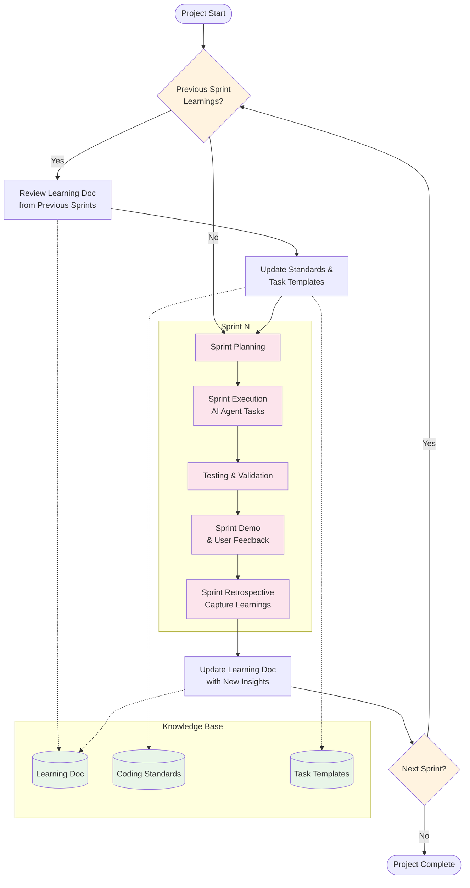

# 4.1_ProjectManagement

## Sprint Cycle Overview

### Sprint Cycle Diagram



### Sprint Cycle Phases

1. **Learning Review**: Apply insights from previous sprints
2. **Sprint Planning**: Define goals and select tasks based on updated knowledge
3. **Sprint Execution**: AI agents complete tasks using refined approaches
4. **Testing & Validation**: Verify functionality and quality
5. **Sprint Demo**: Showcase completed features to stakeholders
6. **Sprint Retrospective**: Capture new learnings and insights
7. **Knowledge Update**: Compound learnings for next cycle

---

## Project Hierarchy

### Definitions

- **Epic**: Large feature spanning multiple sprints (3-8 related stories)
- **Story**: Single functionality deliverable within one sprint (2-6 tasks)
- **Task**: Single technical implementation unit (2-4 hours for AI agents)

### Hierarchy Structure

```
Epic (3-4 weeks)
├── Story 1 (3-5 days)
│   ├── Task 1.1 (2-4 hours)
│   ├── Task 1.2 (2-4 hours)
│   └── Task 1.3 (2-4 hours)
├── Story 2 (3-5 days)
│   ├── Task 2.1 (2-4 hours)
│   └── Task 2.2 (2-4 hours)
└── Story 3 (3-5 days)
    ├── Task 3.1 (2-4 hours)
    ├── Task 3.2 (2-4 hours)
    └── Task 3.3 (2-4 hours)
```
