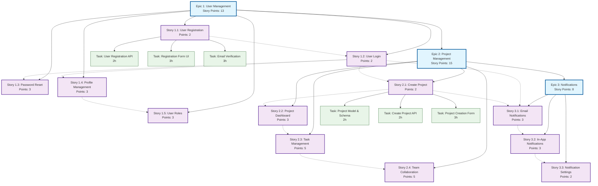

# 4.3_SprintPlanning

## Epic Dependencies Diagram

### Project Structure Visualization

### Dependency Types

#### Epic Dependencies (Sequential)

- **Epic 1 → Epic 2**: User management must exist before project management
- **Epic 2 → Epic 3**: Projects must exist before project-related notifications

#### Story Dependencies (Feature)

- **User Registration → User Login**: Basic user accounts needed for authentication
- **User Login → Password Reset**: Authentication system needed for reset functionality
- **Create Project → Project Dashboard**: Projects must exist to display them

#### Task Dependencies (Technical)

- **Backend API → Frontend UI**: API endpoints needed before UI implementation
- **Database Schema → Business Logic**: Data models needed before service logic
- **Authentication → Protected Features**: Auth system needed for secured functionality
