# 4.5_Task Description Template

# TASK-[ID]: [Clear, Action-Oriented Title]

## Context

- **Epic**: [Parent Epic Name]
- **Story**: [Parent User Story]
- **Sprint**: [Target Sprint Number]
- **Business Value**: [Why this task matters to the user/business]

## Technical Scope

- **Component/Module**: [Specific area of codebase]
- **Implementation Type**: [API endpoint, UI component, utility function, etc.]
- **Files to Create/Modify**:
  - `src/services/auth-service.ts` (create)
  - `src/components/LoginForm.tsx` (modify)

## Requirements

### Input Specifications

- **Data Types**: [TypeScript interfaces or data structures]
- **Validation Rules**: [Required fields, format requirements]
- **Source**: [Where input comes from]

### Output Specifications

- **Return Types**: [TypeScript interfaces for responses]
- **Response Formats**: [JSON structure, HTTP status codes]
- **Side Effects**: [Database changes, external API calls]

### Business Logic

1. [Step-by-step processing requirements]
2. [Conditional logic and decision points]
3. [Data transformation rules]

### Error Handling

- **Validation Errors**: [How to handle invalid input]
- **System Errors**: [Database failures, network issues]
- **User Feedback**: [Error messages and user experience]

## Sequence Diagram

```mermaid
sequenceDiagram
    participant U as 👤 User
    participant F as 🌐 Frontend
    participant A as 🔧 API
    participant D as 🗄️ Database
    participant C as ⚡ Cache

    U->>F: 1. Login Request
    F->>A: 2. POST /auth/login
    A->>D: 3. Validate Credentials
    D-->>A: 4. User Data
    A->>C: 5. Store Session
    A-->>F: 6. JWT Token + User Info
    F-->>U: 7. Dashboard View

    Note over U,C: Subsequent Requests

    U->>F: 8. Data Request
    F->>A: 9. GET /api/data (with token)
    A->>A: 10. Validate Token
    A->>C: 11. Check Cache

    alt Cache Hit
        C-->>A: 12a. Cached Data
    else Cache Miss
        A->>D: 12b. Query Database
        D-->>A: 13b. Fresh Data
        A->>C: 14b. Update Cache
    end

    A-->>F: 15. JSON Response
    F-->>U: 16. Display Data
```



## Success Criteria

- [ ] Functional requirements implemented
- [ ] Input validation working correctly
- [ ] Error scenarios handled appropriately
- [ ] Unit tests written and passing (80% coverage)
- [ ] Integration with existing code verified
- [ ] Code follows coding standards
- [ ] Documentation added for public functions
- [ ] Manual testing completed

## Dependencies

- **Prerequisites**: [Tasks that must be completed first]
- **Blocks**: [Tasks that depend on this completion]

## Implementation Notes

- **Estimated Time**: [2-4 hours for AI agents]
- **AI Suitability**: [High/Medium - most should be High]
- **Complexity Factors**: [What makes this complex or simple]

## Acceptance Examples

```typescript
// Example of expected usage
const result = await authService.loginUser({
  email: 'user@example.com',
  password: 'securepassword'
});

// Expected response
{
  success: true,
  data: {
    user: { id: '123', email: 'user@example.com' },
    token: 'jwt_token_here'
  }
}
```

## Testing Scenarios

1. **Happy Path**: Normal successful execution
2. **Edge Cases**: Boundary conditions, unusual inputs
3. **Error Cases**: Invalid inputs, system failures
4. **Integration**: Interaction with other components
