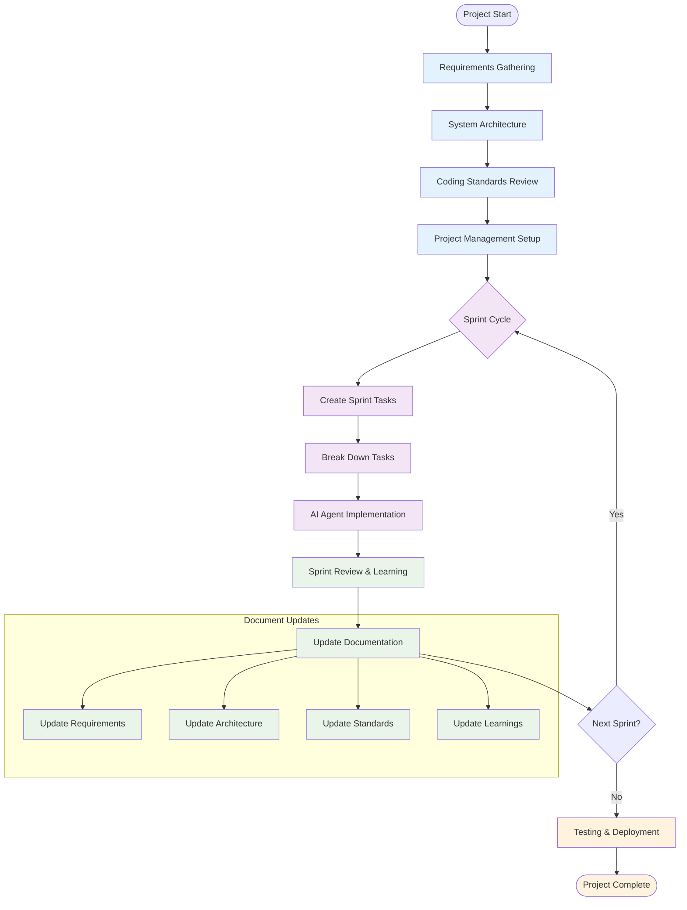

# Getting Started: AI-Assisted Programming Documentation Framework

## Overview

This documentation framework is designed to maximize success rates with AI-assisted programming by providing clear, unambiguous specifications that AI agents can follow systematically. The framework emphasizes front-loading planning and design to create manageable, well-defined tasks for AI agents.

---

## Workflow Overview



---

## Setup Instructions

### 1. Requirements Gathering

**Purpose**: Establish project foundation and business context

**Document**: `1_Requirements.md`

**Process**:

1. Conduct stakeholder interviews
2. Define problem statement and solution
3. Identify target users and scope
4. Document functional and non-functional requirements

**AI Prompt for Requirements Creation**:

```
Using the provided Requirements template, help me create a comprehensive requirements document for my project.

Project Context:
- [Brief project description]
- [Target users]
- [Main problems to solve]

Please ask me questions to fill out each section systematically:
1. Project Overview (problem statement, solution, scope)
2. Functional Requirements (user stories, features)
3. Non-Functional Requirements (performance, security, technical constraints)
4. Assumptions and constraints

For each user story, ensure we define clear acceptance criteria with Given-When-Then format.
```

---

### 2. System Architecture Design

**Purpose**: Define technical foundation and system structure

**Document**: `2_SystemArchitecture.md`

**Prerequisites**: Completed Requirements document

**Process**:

1. Review requirements for technical implications
2. Select technology stack
3. Design high-level architecture
4. Define data model and API structure

**AI Prompt for Architecture Creation**:

```
Based on the requirements in 1_Requirements.md, help me design the system architecture using the SystemArchitecture template.

Context from Requirements:
- [Key functional requirements]
- [Performance requirements]
- [Technical constraints]
- [Integration needs]

Please help me:
1. Select appropriate technology stack for frontend and backend
2. Design high-level system architecture with proper separation of concerns
3. Create data model based on the entities mentioned in requirements
4. Define API structure and authentication strategy
5. Consider scalability and security requirements

Reference the requirements document for specific needs and constraints.
```

---

### 3. Coding Standards Review

**Purpose**: Establish consistent development practices

**Document**: `3_CodingStandards.md`

**Prerequisites**: Technology stack decisions from Architecture

**Process**:

1. Review provided coding standards template
2. Customize for chosen technology stack
3. Add project-specific conventions
4. Ensure AI-friendly guidelines are included

**AI Prompt for Standards Customization**:

```
Help me customize the CodingStandards template for my specific technology stack:

Technology Stack:
- Frontend: [Framework and language]
- Backend: [Framework and language]
- Database: [Database choice]

Please:
1. Update language-specific rules for our chosen stack
2. Configure appropriate linting and formatting tools
3. Customize file organization structure for our project
4. Ensure all guiding principles are clearly defined for AI agents
5. Add any framework-specific best practices

The standards should be optimized for AI agent comprehension and consistent code generation.
```

---

### 4. Project Management Setup

**Purpose**: Organize work into manageable AI-friendly tasks

**Documents**:

- `4.1_ProjectOverview.md`
- `4.2_StoryPointing.md`
- `4.3_EpicDependencies.md`
- `4.4_TaskManagement.md`
- `4.5_SprintExecution.md`
- `4.6_LearningManagement.md`

**Prerequisites**: Requirements and Architecture documents

**Initial Setup Process**:

1. Define epics based on requirements
2. Break epics into user stories
3. Create dependency mapping
4. Set up story pointing system

**AI Prompt for Project Management Setup**:

```
Using the ProjectManagement templates and referencing 1_Requirements.md and 2_SystemArchitecture.md, help me set up the project management framework:

1. Create epics based on the major feature areas in requirements
2. Break down each epic into user stories (2-6 stories per epic)
3. Estimate story points using the provided scale (1,2,3,5,8)
4. Create dependency mapping between epics and stories
5. Plan first sprint with 1-2 stories maximum

Each story should be deliverable within one sprint and broken down into 2-4 hour tasks for AI agents.

Reference the requirements for feature priorities and the architecture for technical dependencies.
```

---

## Sprint Execution Cycle

### Sprint Planning

**Purpose**: Plan sprint goals and select tasks based on learnings

**AI Prompt for Sprint Planning**:

```
Help me plan the next sprint using 4.5_SprintExecution.md template and learning insights:

Previous Sprint Learnings (if any):
- [Key learnings from 4.6_LearningManagement.md]
- [What worked well / what didn't]

Available Stories:
- [List of ready stories from backlog]

Please help me:
1. Review and apply previous sprint learnings
2. Select 1-2 stories for the sprint based on priorities and dependencies
3. Define clear sprint goal
4. Create task breakdown for selected stories
5. Identify potential risks and mitigation strategies

Each task should be 2-4 hours and suitable for AI agent implementation.
```

### Task Creation and Breakdown

**Purpose**: Create specific, implementable tasks for AI agents

**AI Prompt for Task Creation**:

```
Using the 4.4_TaskManagement.md template and referencing the coding standards and architecture docs, help me break down this user story into AI-implementable tasks:

User Story: [Story title and description]
Acceptance Criteria: [List criteria]

Reference Documents:
- Architecture requirements from 2_SystemArchitecture.md
- Coding standards from 3_CodingStandards.md
- Project conventions from 4_ProjectManagement/

Please create tasks following the task template with:
1. Clear technical scope and files to modify
2. Specific input/output requirements
3. Detailed business logic steps
4. Error handling specifications
5. Success criteria and testing requirements

Each task should be independently implementable by an AI agent in 2-4 hours.
```

### Task Implementation

**Purpose**: Execute individual tasks using AI agents

**AI Prompt for Task Implementation**:

```
Implement this task following all project standards and requirements:

Task Details: [Full task description from 4.4_TaskManagement.md]

Reference Documents:
- Requirements: 1_Requirements.md
- Architecture: 2_SystemArchitecture.md
- Coding Standards: 3_CodingStandards.md

Please:
1. Implement the task following all coding standards and architectural patterns
2. Include comprehensive error handling as specified
3. Write unit tests with 80%+ coverage
4. Add appropriate documentation and comments
5. Ensure integration with existing codebase
6. Follow the success criteria checklist

Provide complete, production-ready code that follows all project conventions.
```

### Sprint Review and Learning Capture

**Purpose**: Capture insights and update documentation

**AI Prompt for Sprint Review**:

```
Help me conduct a sprint review and capture learnings using 4.6_LearningManagement.md:

Sprint Summary:
- Sprint goal: [Goal]
- Stories completed: [List]
- Stories incomplete: [List with reasons]

Observations:
- What worked well during the sprint
- What challenges were encountered
- Quality of AI agent implementations
- Estimation accuracy

Please help me:
1. Document key learnings using the learning template
2. Identify patterns and improvements for next sprint
3. Update coding standards if new best practices were discovered
4. Plan knowledge application for next sprint
5. Update task breakdown approaches based on complexity learnings

Format findings according to the learning categories: Technical, AI Agent Optimization, Process Improvements, Quality Enhancements.
```

---

### Documentation Updates

**Purpose**: Keep documentation current with project evolution

**AI Prompt for Documentation Updates**:

```
Help me update project documentation based on sprint learnings and changes:

Changes Made During Sprint:
- [List of implementation changes]
- [Architecture modifications]
- [New requirements discovered]

Learnings Applied:
- [Process improvements]
- [Technical discoveries]
- [Standards updates]

Please review and update:
1. Requirements document if scope or features changed
2. Architecture document if technical decisions evolved
3. Coding standards if new patterns were established
4. Task templates if breakdown approaches improved

Ensure all documents remain consistent and reflect current project state.
```

---

## 5. Testing and Deployment (If Required)

**Purpose**: Establish testing strategy and deployment procedures

**Documents**: `5_Testing.md`, `6_Deployment.md`

**When to Use**:

- When project reaches testable milestones
- When deployment to staging/production is needed
- When comprehensive testing strategy is required

**AI Prompt for Testing Setup**:

```
Using 5_Testing.md template and referencing the architecture and requirements, help me establish testing strategy:

Project Context:
- Technology stack: [From architecture]
- Key features: [From requirements]
- Quality requirements: [From requirements]

Please help me:
1. Set up appropriate testing pyramid for our stack
2. Create test templates for unit, integration, and E2E tests
3. Configure testing tools and CI/CD integration
4. Define quality gates and coverage requirements
5. Create test data management strategy

Focus on automated testing that supports AI-assisted development workflow.
```

**AI Prompt for Deployment Setup**:

```
Using 6_Deployment.md template, help me set up deployment pipeline:

Infrastructure Context:
- Hosting platform: [Choice from architecture]
- Technology stack: [From architecture]
- Environment requirements: [From requirements]

Please help me:
1. Configure appropriate deployment strategy (blue-green, rolling, canary)
2. Set up CI/CD pipeline with proper testing gates
3. Create environment-specific configurations
4. Establish monitoring and health checks
5. Define rollback procedures and emergency protocols

Ensure deployment supports the AI-assisted development workflow with automated testing and validation.
```

---

## Best Practices

### For AI Agent Success

1. **Specific Instructions**: Always provide detailed, unambiguous task descriptions
2. **Context Reference**: Include relevant documentation references in prompts
3. **Iterative Approach**: Break large tasks into smaller, manageable pieces
4. **Validation Criteria**: Define clear success criteria for each task
5. **Learning Integration**: Apply insights from previous sprints to improve future tasks

### For Documentation Maintenance

1. **Living Documents**: Update documentation as the project evolves
2. **Consistency Checks**: Ensure all documents remain aligned
3. **Learning Capture**: Document insights and improvements systematically
4. **Template Adherence**: Follow templates to maintain consistency

### For Quality Assurance

1. **Code Reviews**: Human review of AI-generated code
2. **Testing Requirements**: Comprehensive testing at all levels
3. **Standards Compliance**: Consistent adherence to coding standards
4. **Documentation Updates**: Keep documentation current with implementation

---

## Troubleshooting

### Common Issues and Solutions

**AI Agent Task Failures**:

- Review task description for ambiguity
- Ensure all prerequisites are clearly defined
- Break task into smaller components
- Add more specific technical details

**Documentation Inconsistencies**:

- Regular cross-document reviews
- Update all affected documents when changes occur
- Use consistent terminology across documents

**Sprint Planning Issues**:

- Review story point estimates against actual completion times
- Adjust task breakdown based on AI agent capabilities
- Apply learnings from previous sprints

**Quality Issues**:

- Strengthen definition of done criteria
- Improve test coverage requirements
- Enhance code review processes
