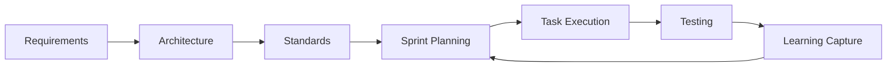

# AI-Assisted Programming (AAP) Template

## What This Framework Is

This is a comprehensive documentation system designed to maximize success rates with AI-assisted programming. It transforms complex software projects into clear, actionable specifications that AI agents can follow systematically.

**Core Philosophy**: Front-load Overview and design to create manageable, well-defined tasks for AI agents.

## Purpose and Benefits

### Problems This Solves

- **Ambiguous Requirements** → Clear, testable specifications
- **Complex Tasks** → Bite-sized, implementable work items
- **Inconsistent Code** → Standardized patterns and practices
- **Knowledge Loss** → Cumulative learning and pattern recognition
- **Agent Failures** → Optimized prompts and task definitions

### Key Benefits

- **80%+ AI Task Success Rate** through proper breakdown and specification
- **Consistent Code Quality** via enforced standards and patterns
- **Faster Development** through reusable patterns and optimized workflows
- **Knowledge Accumulation** that improves over time
- **Reduced Technical Debt** through upfront architectural Overview

## Framework Structure

```
Project Documentation Framework/
├── 1.1_Requirements.md           # Business requirements and acceptance criteria
├── 2.1_SystemArchitecture.md     # Technical architecture and design decisions
├── 3.1_CodingStandards.md        # Code quality standards and AI guidelines
├── 4.1.1_ProjectManagementGuide.md  # Sprint cycles and work organization
├── 4.2.1_EpicsOverview.md        # Epic overview from requirements
├── 4.3.1_StoriesOverview.md      # Story overview from epics
├── 4.4.1_TasksOverview.md        # Task overview from stories
├── 4.5.1_CummulativeLearnings.md # Knowledge accumulation and patterns
├── EPIC-xxx.md                   # Individual epic specifications
├── STORY-xxx.md                  # Individual story specifications
├── TASK-xxx.md                   # Individual task specifications (AI-ready)
└── GettingStarted.md             # This guide
```

A comprehensive documentation framework designed to maximize success rates when working with AI agents in software development projects.

## Overview

The AAP Template provides a structured approach to AI-assisted programming by emphasizing clear specifications, systematic planning, and continuous learning. This template helps teams leverage AI agents effectively while maintaining high code quality and predictable workflows.

## Why Use This Template?

- **Higher AI Success Rates**: Clear specifications reduce ambiguity and revision cycles
- **Scalable Knowledge**: Built-in learning system improves efficiency over time
- **Quality Assurance**: Comprehensive testing and validation at every level
- **Consistency**: Standardized templates ensure uniform documentation
- **Traceability**: Clear hierarchy from requirements to implementation

## Template Structure

```
ProjectPlanTemplate/
 1_Requirements/          # Project foundation and business context
 2_SystemArchitecture/    # Technical architecture and design
 3_CodingStandards/       # Development practices and conventions
 4_ProjectManagement/     # Sprint planning and task management
 5_Testing/               # Testing strategies and templates
 6_Deployment/            # Deployment procedures and infrastructure
 GettingStarted.md        # Quick start guide
```

## Key Features

### 1. Task Granularity

All tasks are broken down into 2-4 hour units, perfectly sized for AI agent implementation.

### 2. Learning Loop System

- Captures insights from each sprint
- Updates standards and templates based on learnings
- Compounds knowledge over time for better AI performance

### 3. Clear Success Criteria

Every task includes:

- Specific input/output requirements
- Detailed business logic steps
- Error handling specifications
- Testing requirements

### 4. Visual Documentation

Extensive use of Mermaid diagrams for system architecture, workflows, and sequence diagrams.

## Getting Started

1. **Clone the template**

   ```bash
   git clone <repository-url>
   cd aap-template
   ```

2. **Read the Getting Started Guide**

   ```bash
   open ProjectPlanTemplate/GettingStarted.md
   ```

3. **Follow the setup workflow**
   - Define your requirements
   - Design your system architecture
   - Establish coding standards
   - Plan your first sprint

## Workflow Overview



## Project Management Hierarchy

- **Epic**: Large feature or initiative (multiple sprints)
- **Story**: User-facing functionality (1-2 per sprint)
- **Task**: AI-implementable work unit (2-4 hours)

## Sprint Cycle

1. **Review**: Analyze previous sprint learnings
2. **Plan**: Select 1-2 stories for the sprint
3. **Break Down**: Convert stories into AI-friendly tasks
4. **Execute**: Implement tasks with AI agents
5. **Test**: Validate implementation
6. **Learn**: Capture insights for future improvements

## Testing Strategy

The template follows the testing pyramid:

- **70%** Unit Tests
- **20%** Integration Tests
- **10%** End-to-End Tests

## Best Practices

1. **Start Small**: Begin with a single story in your first sprint
2. **Document Everything**: Use the provided templates consistently
3. **Iterate Frequently**: Regular learning cycles improve AI performance
4. **Visual First**: Use diagrams to communicate complex concepts
5. **Test Continuously**: Validate at every level of development

## Template Components

### Requirements (Section 1)

Establishes project foundation with:

- Project overview and objectives
- Functional and non-functional requirements
- User stories with acceptance criteria
- Given-When-Then scenarios for AI comprehension

### System Architecture (Section 2)

Defines technical structure with:

- Technology stack decisions
- Architecture diagrams (Mermaid)
- Data models and schemas
- API specifications

### Coding Standards (Section 3)

Ensures consistency with:

- Language-specific guidelines
- File organization patterns
- Naming conventions
- Documentation requirements

### Project Management (Section 4)

Provides comprehensive planning with:

- Sprint cycle management
- Story pointing methodology
- Task breakdown templates
- Execution guidelines
- Sprint review processes

### Testing (Section 5)

Establishes quality assurance with:

- Testing strategies
- Test case templates
- Coverage requirements
- AI-friendly test examples

### Deployment (Section 6)

Defines release processes with:

- CI/CD pipeline setup
- Environment configurations
- Monitoring strategies

## Contributing

This template is designed to evolve with your learnings. Update documentation and templates based on your project experiences to continuously improve AI agent performance.

## License

MIT

## Support

For questions or suggestions, please open an issue or refer to the comprehensive documentation in each section.

---

_Built for teams embracing the future of AI-assisted software development_
