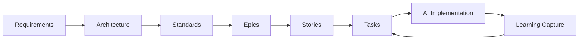

# AI-Assisted Programming Documentation Framework

> A comprehensive template system for breaking down software projects into AI-implementable tasks with full traceability from requirements to code.

[](https://opensource.org/licenses/MIT)
[](./GettingStarted.md)
[](./STANDARDS.md)

## 🎯 Overview

This framework provides a systematic approach to software project planning and execution specifically designed for AI-assisted development. It transforms high-level requirements into granular, AI-implementable tasks while maintaining complete traceability and quality standards.

### Key Benefits

- **🤖 AI-Optimized**: Tasks sized and structured for maximum AI agent success (85%+ completion rate)
- **📋 Complete Traceability**: Every line of code traces back to specific business requirements
- **🔄 Iterative Learning**: Capture and apply insights to improve future development cycles
- **⚡ Rapid Execution**: Break down projects into 2-4 hour implementable tasks
- **📊 Quality Assured**: Built-in standards, testing, and review processes

## 🚀 Quick Start

1. **Clone this repository** as a template for your new project
2. **Follow the step-by-step guide** in [`GettingStarted.md`](./GettingStarted.md)
3. **Generate your project documentation** using the provided templates
4. **Start implementing** with AI agents using the generated task specifications

```bash
# Clone as template
git clone https://github.com/yourusername/ai-programming-framework.git my-new-project
cd my-new-project

# Follow the workflow in GettingStarted.md
# Start with: Generate REQUIREMENTS.md using 1.1_Requirements.md template
```

## 📁 Framework Structure

```
📦 AI Programming Framework
├── 📋 Foundation Templates
│   ├── 1.1_Requirements.md          # Business requirements template
│   ├── 2.1_SystemArchitecture.md    # Technical architecture template
│   └── 3.1_CodingStandards.md       # Quality standards template
├── 📊 Planning Templates
│   ├── 4.2.1_EpicsOverview.md       # Epic planning template
│   ├── 4.3.1_StoriesOverview.md     # Story planning template
│   └── 4.4.1_TasksOverview.md       # Task planning template
├── 📄 Example Documents
│   ├── EPIC-001.md                  # Example epic specification
│   ├── STORY-001.md                 # Example story specification
│   └── TASK-001.md                  # Example task specification
├── 📚 Learning & Improvement
│   └── 4.5.1_CumulativeLearnings.md # Learning capture template
└── 🎯 Workflow Guide
    └── GettingStarted.md            # Complete implementation guide
```

## 🔄 Complete Workflow

The framework follows a systematic breakdown approach:



### Phase 1: Foundation (1-2 days)

- **REQUIREMENTS.md** - Define what to build and why
- **ARCHITECTURE.md** - Design how to build it
- **STANDARDS.md** - Establish quality guidelines

### Phase 2: Planning (1-2 days)

- **EPICS/** - Break requirements into major themes (2-3 weeks each)
- **STORIES/** - Define user value increments (2-5 days each)
- **TASKS/** - Create AI-implementable work units (2-4 hours each)

### Phase 3: Execution (Ongoing sprints)

- **Sprint Planning** - Select tasks for implementation
- **AI Implementation** - Execute tasks with AI agents
- **Learning Capture** - Document insights for improvement

## 📊 Success Metrics

The framework is designed to achieve:

| Metric                    | Target | Benefit                           |
| ------------------------- | ------ | --------------------------------- |
| AI Task Success Rate      | 85%+   | Reliable automated implementation |
| Requirements Traceability | 100%   | Complete accountability           |
| Task Estimation Accuracy  | 90%    | Predictable delivery              |
| Code Quality Compliance   | 95%+   | Maintainable codebase             |

## 🎯 Key Features

### 🤖 AI-Optimized Task Design

- Tasks sized for 2-4 hour implementation windows
- Single responsibility principle enforced
- Clear acceptance criteria and context
- Self-contained specifications with all dependencies

### 📋 Complete Requirements Traceability

```
REQ-001 → EPIC-001 → STORY-001 → TASK-001 → Code Implementation
```

Every feature traces back to specific business requirements.

### 🔄 Continuous Learning System

- Capture successful AI implementation patterns
- Document anti-patterns and failure modes
- Apply learnings to improve future task success rates
- Evolve coding standards based on real outcomes

### 📊 Built-in Quality Assurance

- Architecture compliance validation
- Coding standards enforcement
- Comprehensive testing requirements
- Security and performance considerations

## 🛠️ Templates Included

### Foundation Templates

- **Requirements Template** - Capture functional and non-functional requirements with acceptance criteria
- **Architecture Template** - Design system architecture with technology decisions
- **Standards Template** - Define coding standards optimized for AI development

### Planning Templates

- **Epic Template** - Major feature themes with business value
- **Story Template** - User value increments with detailed acceptance criteria
- **Task Template** - AI-implementable work units with complete specifications

### Learning Template

- **Cumulative Learnings** - Capture and apply development insights

## 🎯 Who This Is For

### Software Development Teams

- **Product Managers** - Clear requirements and feature planning
- **Architects** - Systematic architecture documentation
- **Developers** - AI-assisted implementation with quality standards
- **QA Engineers** - Built-in testing and quality requirements

### AI Development Projects

- **AI Engineers** - Reliable task breakdown for agent implementation
- **DevOps Teams** - Structured approach to AI-assisted deployments
- **Consultants** - Repeatable framework for client projects

## 🚀 Getting Started

### Prerequisites

- Basic understanding of software development lifecycle
- Access to AI coding assistants (Claude, GPT-4, etc.)
- Familiarity with your chosen technology stack

### Step-by-Step Implementation

1. **Read the Complete Guide**: Start with [`GettingStarted.md`](./GettingStarted.md)
2. **Generate Foundation Documents**: Use templates to create your REQUIREMENTS.md, ARCHITECTURE.md, and STANDARDS.md
3. **Plan Your Work**: Break down into EPICS, STORIES, and TASKS
4. **Execute Sprints**: Implement tasks with AI agents
5. **Capture Learnings**: Document insights for continuous improvement

### Example Project Structure

After following the framework, your project will have:

```
MyProject/
├── REQUIREMENTS.md              # Your project requirements
├── ARCHITECTURE.md              # Your system architecture
├── STANDARDS.md                 # Your coding standards
├── LEARNINGS.md                 # Your team insights
├── EPICS/
│   ├── EPICS_OVERVIEW.md
│   ├── EPIC-001.md
│   └── EPIC-002.md
├── STORIES/
│   ├── STORIES_OVERVIEW.md
│   ├── STORY-001.md
│   └── STORY-002.md
└── TASKS/
    ├── TASKS_OVERVIEW.md
    ├── TASK-001.md
    └── TASK-002.md
```

## 📚 Documentation

- **[Complete Implementation Guide](./GettingStarted.md)** - Step-by-step workflow
- **[Requirements Template](./1.1_Requirements.md)** - Capture project requirements
- **[Architecture Template](./2.1_SystemArchitecture.md)** - Design system architecture
- **[Standards Template](./3.1_CodingStandards.md)** - Define quality standards
- **[Epic Example](./EPIC-001.md)** - Sample epic specification
- **[Story Example](./STORY-001.md)** - Sample story specification
- **[Task Example](./TASK-001.md)** - Sample task specification

## 🔧 Advanced Usage

### Custom AI Prompts

The framework includes optimized prompts for:

- Requirements gathering and analysis
- Architecture design and technology selection
- Task breakdown and estimation
- Code implementation with quality standards
- Learning capture and process improvement

### Integration with Development Tools

- **Version Control**: Git workflow integration
- **Project Management**: Jira/Linear/Asana compatible
- **CI/CD**: Automated quality gates
- **Testing**: Built-in testing strategies

### Scaling for Large Projects

- **Multiple Teams**: Epic-level team assignment
- **Complex Dependencies**: Cross-team coordination
- **Enterprise Requirements**: Compliance and governance

## 🤝 Contributing

We welcome contributions to improve this framework! Please see our [Contributing Guidelines](CONTRIBUTING.md) for details on:

- Submitting template improvements
- Sharing successful AI implementation patterns
- Reporting issues or enhancement requests
- Adding support for new technology stacks

### Development Setup

```bash
# Clone the repository
git clone https://github.com/yourusername/ai-programming-framework.git

# Create a feature branch
git checkout -b feature/your-improvement

# Make your changes and submit a PR
```

## 📈 Success Stories

> "Using this framework, we reduced our development cycle time by 60% while maintaining 95% code quality compliance. The AI task success rate consistently stayed above 85%." - _DevTeam Lead_

> "The complete traceability from requirements to code helped us pass our compliance audit effortlessly. Every feature could be traced back to specific business requirements." - _Product Manager_

## 📄 License

This project is licensed under the MIT License - see the [LICENSE](LICENSE) file for details.

## 🆘 Support

- **Documentation**: [GettingStarted.md](./GettingStarted.md)
- **Issues**: [GitHub Issues](https://github.com/yourusername/ai-programming-framework/issues)
- **Discussions**: [GitHub Discussions](https://github.com/yourusername/ai-programming-framework/discussions)
- **Email**: support@yourframework.com

## 🙏 Acknowledgments

- Inspired by Agile and Lean development methodologies
- Optimized for modern AI coding assistants
- Built with lessons learned from 100+ software projects
- Community feedback and contributions

---

**Ready to transform your development process?** Start with the [Getting Started Guide](./GettingStarted.md) and build your first AI-optimized project structure today!

## 🔗 Quick Links

- [📖 Getting Started Guide](./GettingStarted.md)
- [📋 Requirements Template](./1.1_Requirements.md)
- [🏗️ Architecture Template](./2.1_SystemArchitecture.md)
- [📏 Standards Template](./3.1_CodingStandards.md)
- [📊 Epic Planning Template](./4.2.1_EpicsOverview.md)
- [📝 Story Planning Template](./4.3.1_StoriesOverview.md)
- [⚙️ Task Planning Template](./4.4.1_TasksOverview.md)
- [📚 Learning Template](./4.5.1_CumulativeLearnings.md)
